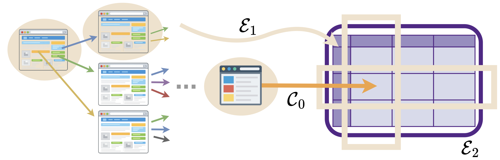

# 🌍 SODIUM: From Open Web Data to Queryable Databases

This repository contains the reproduction artifact for the VLDB 2026 March submission (Paper ID 2250):

> **SODIUM: From Open Web Data to Queryable Databases**.


## 🧐 Overview

Many research tasks require collecting data scattered across specialized websites and organizing it into structured tables before analysis can begin. For example, demographic or economic studies often retrieve statistics from government portals where relevant values are distributed across multiple webpages and datasets.

In this work, we formalize this process as the **SODIUM** task, which focuses on **S**tructuring **O**pen **D**oma**I**n **U**nstructured Data into **M**aterialized Databases.

To systematically evaluate this problem, we construct **SODIUM-Bench**, a benchmark of analytical queries derived from published research papers, where systems must explore specialized web domains in depth and populate structured tables with the required values.

To address this challenge, we develop **SODIUM-Agent**, a multi-agent system composed of a web explorer and a cache manager. Powered by our proposed ATP-BFS algorithm and optimized through principled management of cached sources and navigation paths, SODIUM-Agent conducts deep and comprehensive web exploration and performs structurally coherent information extraction.

SODIUM-Agent achieves **91.1% accuracy** on SODIUM-Bench, outperforming the strongest baseline by approximately **2×** and the weakest by up to **73×**.

<p align="center">
  
</p>
<p align="left">
  <em>
  Solving SODIUM is driven by (C0) in-depth exploration of specialized websites, strengthened by
  (E1) exploiting structural correlations, and (E2) integrating collected information into
  coherent, queryable database instances.
  </em>
</p>

## 📦 Data: SODIUM-Bench

SODIUM-Bench (`sodium-bench/`) contains **105 analytical tasks**, each providing:

- a **query** (`sodium-bench/queries.json`)
- a **base website** (`sodium-bench/queries.json`)
- a **target schema** (`sodium-bench/schema/`)

Systems are required to explore the base website and populate the table with values that answer the query.

## 🚀 Running the Systems

Each system is located in its own folder (e.g., `sodium-agent`, `baselines/ag2`) with a dedicated README. To run a system on a specific benchmark task, go to the corresponding folder and follow its README. For example:

```bash
cd sodium-agent
python run_sodium_bench.py --id <id>
```

Outputs are saved in `logs/sodium_{id}_{timestamp}/output.csv`.

## 📊 Evaluation

The ground truth tables are in `sodium-bench/eval/gt/`.

We evaluate predictions using two complementary metrics: (1) exact match (`sodium-bench/eval/utils/match.py`), and (2) LLM-as-a-judge (`sodium-bench/eval/utils/llm.py`).

The full evaluation script is in `sodium-bench/eval/evaluation.py`. Run it from the `sodium-bench/eval/` directory:

```bash
cd sodium-bench/eval
python evaluation.py --id <id> --output_csv path/to/output.csv
```

Optional arguments:

```bash
python evaluation.py --id 1 --output_csv path/to/output.csv --queries_path ./queries.json --gt_root ./gt --out_root ./eval_outputs
```

Evaluation outputs are written to `eval_outputs/{id}/`, including:

- `string_match.csv`
- `llm_match.csv`
- `llm_eval.log`