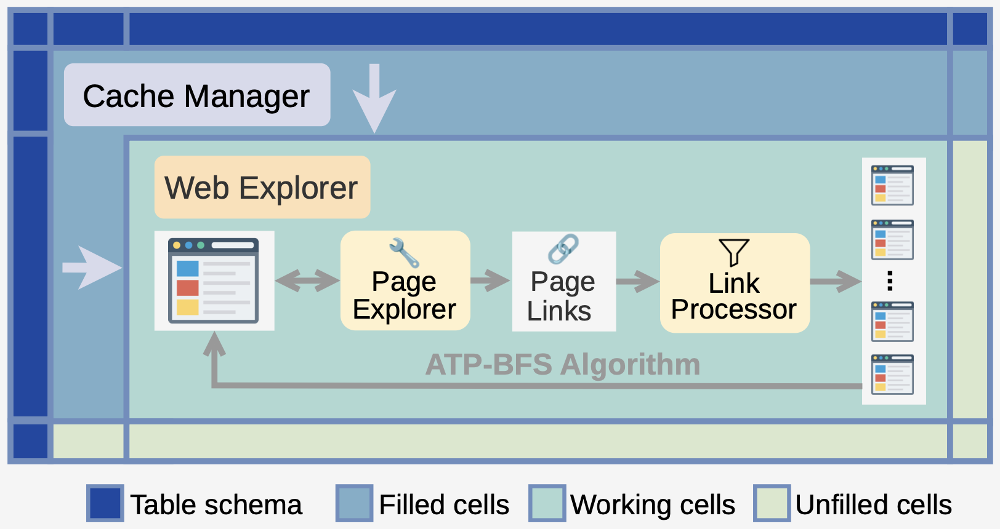

# 🤖 SODIUM-Agent

This folder contains the implementation of **SODIUM-Agent**.

SODIUM-Agent consists of two sub-agents:

### 🌐 Web Explorer (`./web_explorer.py`)

The web explorer is powered by the **ATP-BFS** algorithm, implemented in```./web_explorer/web_explorer.py```
(specifically the `atp_bfs` function).

ATP-BFS is executed through two components:

- **Page Explorer** (`./web_explorer/page_explorer.py`)
- **Link Processor** (`augment_select_rank` in `web_explorer.py`)

The **page explorer** invokes different explorers depending on webpage types:

- **Static webpages** (`./web_explorer/static_explorer.py`)
- **Dynamic webpages** (`./web_explorer/dynamic_explorer.py`)
- **Online files** (`./web_explorer/online_file_explorer.py`)

### ♻️ Cache Manager (`./cache_manager.py`)

<p align="center">
  
</p>
<p align="center">
  <em>
Overview of SODIUM-Agent.
  </em>
</p>


## 🛠️ Setup SODIUM-Agent

Install dependencies:

```bash
pip install openai pandas requests pymupdf playwright
playwright install
```

Set your OpenAI API key:

```bash
export OPENAI_API_KEY=your_key_here
```

## 🚀 Run SODIUM-Agent

```bash
python run_sodium_bench.py --id <query_id>
```

Example:

```bash
python run_sodium_bench.py --id 1
```

Outputs will be written to `logs/sodium_{id}_{timestamp}/`.
The folder contains an `output.csv` file with the predicted table and the following execution information:

Each `(primary_key_value, column)` pair has a folder:```{pkval}-{col}/```.
This folder contains:

- SODIUM-Agent's execution logs `cache_manager.jsonl` and `web_explorer_{i}.jsonl` (exploration logs for round *i*).
Each log entry has the format:

```json
{
  "name": function name,
  "input": input information,
  "output": response texts,
  "usage": {
    "input_tokens": input tokens,
    "output_tokens": output tokens
  },
  "cost": cost for this function,
  "additional_info": additional information
}
```
- `summary.json` records the final result for a cell:

```json
{
  "cost": total costs for filling this cell,
  "value": value for this cell,
  "row": filled attributes for this primary key value,
  "source": source for this cell
}
```